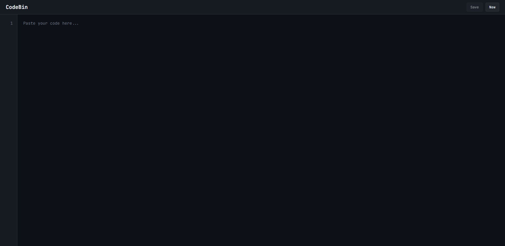

# CodeBin ✒️

**A minimalist, fast, and modern code sharing tool (pastebin) built with pure PHP and JavaScript.**

CodeBin provides a clean, distraction-free interface for quickly sharing code snippets. It features automatic syntax highlighting, secure and short URLs, and a responsive design that looks great on any device.

---

### Ekran Görüntüsü



---

### ✨ Özellikler

- **Modern ve Temiz Arayüz:** Kodunuza odaklanmanızı sağlayan minimalist tasarım.
- **Otomatik Sözdizimi Vurgulama (Syntax Highlighting):** [highlight.js](https://highlightjs.org/) kütüphanesi ile onlarca dil için otomatik renklendirme.
- **Güvenli ve Temiz URL'ler:** Kaydedilen her kod parçası için tahmin edilemez, kısa ve uzantısız URL'ler (`/a8c3e7f1b9d2`).
- **Satır Numaralandırma:** Kodun daha kolay okunmasını sağlayan dinamik satır numaraları.
- **Tek Tıkla Kopyalama ve Ham Görünüm:** Paylaşılan kodu kolayca kopyalayın veya düz metin olarak görüntüleyin.
- **Klavye Kısayolları:** `Ctrl+S` (Kaydet), `Ctrl+N` (Yeni) gibi kısayollarla verimli kullanım.
- **Hafif ve Hızlı:** Gereksiz kütüphaneler olmadan, saf PHP ve JavaScript ile oluşturulmuştur.
- **Sunucu Taraflı Güvenlik:** XSS saldırılarını önlemek için `htmlspecialchars` ve güvenli ID doğrulaması.

---

### 🛠️ Teknik Yapı

- **Backend:** PHP (Frameworksüz)
- **Frontend:** HTML5, CSS3, JavaScript (Vanilla JS)
- **Sözdizimi Vurgulama:** [highlight.js](https://highlightjs.org/)

---

### 🚀 Kurulum ve Başlatma

Bu projeyi kendi sunucunuzda çalıştırmak için aşağıdaki adımları izleyin.

**Gereksinimler:**
- PHP 7.4 veya üstü
- Apache veya Nginx gibi bir web sunucusu
- Apache için `mod_rewrite` modülünün aktif olması

**Adım 1: Projeyi Klonlayın**
```bash
git clone https://github.com/ethemdemirkaya/codebin.git
cd codebin
```

**Adım 2: Klasör İzinlerini Ayarlayın**
Kaydedilen kodların tutulacağı `pastes` klasörünü oluşturun ve web sunucusunun bu klasöre yazma izni olduğundan emin olun.
```bash
mkdir pastes
chmod -R 755 pastes
# Sunucu kullanıcınıza göre (örn: www-data) sahipliği değiştirmeniz gerekebilir:
# chown -R www-data:www-data pastes
```

**Adım 3: URL Yönlendirmesini Yapılandırın (Çok Önemli!)**
Projenin temiz URL'ler (`/abc123xyz`) ile çalışabilmesi için bir `.htaccess` dosyasına ihtiyacınız var. Proje ana dizinine `.htaccess` adında bir dosya oluşturun ve içine şunu ekleyin:

```apache
RewriteEngine On

# Handle homepage
RewriteRule ^$ index.php [L]

# Handle clean URLs for paste viewing
RewriteRule ^([a-zA-Z0-9]+)$ view.php?id=$1 [L]

# Optional: Force HTTPS (uncomment if needed)
# RewriteCond %{HTTPS} off
# RewriteRule ^(.*)$ https://%{HTTP_HOST}%{REQUEST_URI} [L,R=301]
```

**Adım 4: Projeyi Çalıştırın**
Web sunucunuzun kök dizinine dosyaları yerleştirin ve tarayıcınızdan site adresinize gidin. Hepsi bu kadar!

---

### 📄 Lisans

Bu proje [MIT Lisansı](LICENSE) ile lisanslanmıştır.